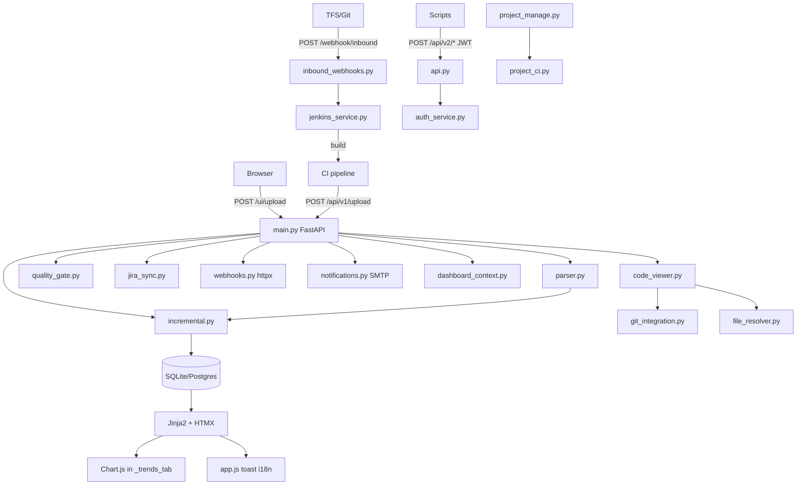

# PVS-Tracker: контекст проекта

## Зачем существует

SonarQube не закрывает инкрементальные отчёты PVS-Studio. Сервис:

- принимает JSON из CI;
- считает `new` / `existing` / `fixed` между запусками;
- показывает тренды, таблицы, code viewer;
- даёт API v2 (RBAC, quality gates, комментарии);
- деплоится без Docker.

## Архитектура

## Ключевые решения

| Решение | Альтернатива | Причина |
|---------|--------------|---------|
| Пакет `pvs_tracker/` | Flat scripts | Масштаб v0.2: api, auth_service, quality gates |
| `RunReport` в БД | Папка `reports/` | Единое хранение с метаданными run |
| Fixed в **текущем** run | Обновлять prev run | История run неизменна; см. `incremental.py` |
| `__analysis__/{code}` | Skip meta-warnings | Отслеживание V010 и аналогов |
| HTMX partials | SPA | Быстрый UI, мало JS |
| Branch switcher в UI | — | Фильтр графика/issues; **diff без branch** |
| `target_platform` на Run | Один run на все ОС | Diff и метрики per OS; cross_platform_fp для сопоставления путей |
| In-page platform switch | Reload dashboard | `platform-metrics` + `trends-fragment` + JS в `_scripts.html` |
| Unified login | Разные entrypoints | `authenticate_credentials` для UI и API v2; JWT + session cookie |
| Webhook env URL | Per-project URL | `WEBHOOK_URL` глобально в v1 |
| Email подписчики | Webhook per user | `UserProjectNotification` + SMTP только на `/api/v1/upload` |
| Quality gate | Metric thresholds | Набор `rule_code`; fail при new в scope |

## Frontend

### Главная и проекты

- **`/`** (`home.html`) — `
` по группам; цвет карточки: красный `disabled`, горчичный `disable_jira`, синий иначе (как PVS_Sonar list).
- **`/ui/projects/new`** — форма Sonar-полей (`projects/_form_fields.html`, `static/project-form.js`).
- **`/ui/projects/{id}/edit`** — редактирование проекта (POST → `/ui/projects/{id}/ci`).
- **`/ui/projects/{id}/clone`** — клон с предзаполненной формой.
- **`/ui/projects/manage`** — редирект 303 на `/`.

### Дашборд (`/ui/projects/{id}/dashboard`)

| Вкладка | Шаблон | Назначение |
|---------|--------|------------|
| Overview | `_overview_tab.html` | KPI, quality gate strip |
| Issues | `_issues_tab.html` | HTMX-таблица; inline Code в `issue_row.html` |
| Code | `_code_tab.html` | дерево файлов |
| Trends | `_trends_tab.html` | Chart.js |
| Analysis / CI | `_ci_tab.html`, `_ci_panel.html` | Jenkins/Jira toggles; toast через `#ci-toast-payload` + `app.js` |
| Upload | `_upload_tab.html` | JSON + snapshot |
| Settings | `_settings_tab.html` | подвкладки: params (`_settings_params_panel.html`), source roots, quality gate |

- Удаление проекта: кнопка в `dashboard.html` (header, admin).
- Query: `?tab=`, `?settings_tab=params|sources|quality`, `?branch=`, `?platform_filter=`.

### Прочий UI

- **Платформы:** `_platform_switcher.html`, `_trends_content.html`.
- **Глобальные настройки:** `/ui/settings/profile`, `/ui/settings/quality-gates`, `/ui/settings/global`.
- **i18n:** `static/translations.json` + `app.js` (`data-i18n`).
- **Toast:** `showToast()` — класс `sq-toast` (не bootstrap `.toast`, иначе `display:none`).
- **HTMX:** `partials/*`, `code_view.html` **без** `base.html`; CI panel `#project-ci-panel`.

## Auth (фактическое состояние)

| Поверхность | Поведение |
|-------------|-----------|
| `POST /login`, `POST /api/v2/auth/login` | `authenticate_credentials`: локальный `User` (bcrypt) или LDAP (`LDAP_ENABLED`) |
| Сессия UI | `user_id` + `user` (username) через `establish_session` |
| LDAP JIT | Новый пользователь → `User` с `auth_provider=ldap`, роль **Viewer** |
| `/ui/upload`, create/edit project, settings | `require_auth` → 401 без сессии |
| Dashboard, `/ui/issues`, code viewer | **без** auth (открыты, read-only) |
| `/api/v2/*` | JWT Bearer и/или session → `User`; admin из `migrate.py` |
| Управление пользователями | `/ui/settings/global` (Users), API v2 `users`, `admin/groups` |

## Инкрементальный diff — важно

- `prev_fps` исключает `ignored` и `fixed` из прошлого run.
- Исчезнувшие FP → новые `Issue` с `status=fixed` в **текущем** `run_id`.
- Сравнение prev run: последний `done` по проекту и **target_platform**, не по ветке UI.
- `cross_platform_fp` учитывает source roots (project + GlobalSettings) при сопоставлении путей между ОС.

## Upload metadata и автор issues

- CI может передать `.meta.json` (`commit`, `commit_author_name`, `commit_author_email`) — парсер `upload_metadata.py`; поля формы имеют приоритет ниже файла.
- `Run.commit_author_*` заполняются при upload; в webhook payload и Jira description.
- `issue_author.resolve_issue_author`: **new** → автор коммита run; **existing** / **fixed** → наследование с prev issue (или run при первом анализе платформы).

## Группы проектов

- Таблица `ProjectGroup` + `project_groups.py`; fallback на константы QA/QD/… если таблица пуста.
- CRUD: `GET/POST/PUT/DELETE /api/v2/admin/groups` (admin).
- Формы create/edit/clone: `group_id` из БД.

## PVS JSON

1. Два формата (modern / legacy).
2. Несколько `positions[]` → несколько issues.
3. Пустой file → `__analysis__/{code}`.
4. Пути нормализуются в fingerprint (`\` → `/`).

## Границы

- ✅ Upload, diff (per platform), UI, API v2, CI/Jira/Jenkins, монолит project_manage, code viewer, webhooks, quality gates, CSV export
- ❌ Сам анализ PVS, Docker/K8s, diff по branch (TODO), отдельный Sonar-сервис (заменён трекером)

## Для агентов Cursor

Читать: `spec.md`, `rules.md`, skill `pvs-tracker-dev`.
