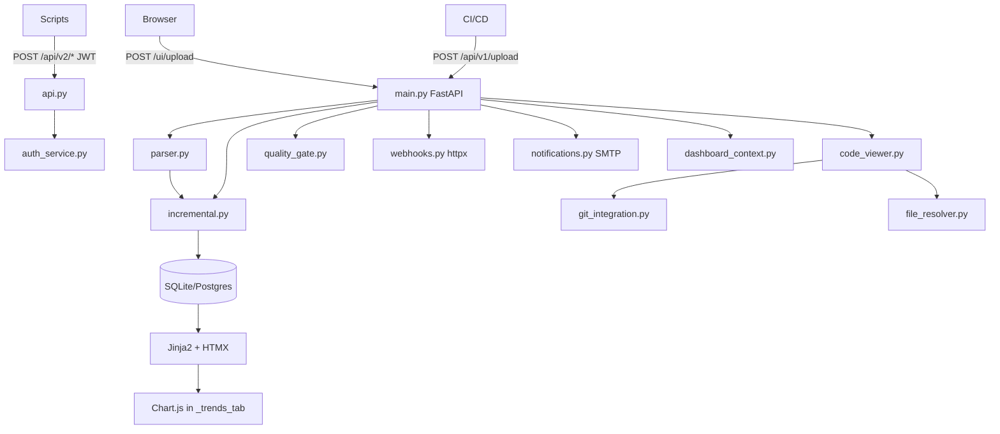

# PVS-Tracker: контекст проекта

## Зачем существует

SonarQube не закрывает инкрементальные отчёты PVS-Studio. Сервис:

- принимает JSON из CI;
- считает `new` / `existing` / `fixed` между запусками;
- показывает тренды, таблицы, code viewer;
- даёт API v2 (RBAC, quality gates, комментарии);
- деплоится без Docker.

## Архитектура

## Ключевые решения

| Решение | Альтернатива | Причина |
|---------|--------------|---------|
| Пакет `pvs_tracker/` | Flat scripts | Масштаб v0.2: api, auth_service, quality gates |
| `RunReport` в БД | Папка `reports/` | Единое хранение с метаданными run |
| Fixed в **текущем** run | Обновлять prev run | История run неизменна; см. `incremental.py` |
| `__analysis__/{code}` | Skip meta-warnings | Отслеживание V010 и аналогов |
| HTMX partials | SPA | Быстрый UI, мало JS |
| Branch switcher в UI | — | Фильтр графика/issues; **diff без branch** |
| `target_platform` на Run | Один run на все ОС | Diff и метрики per OS; cross_platform_fp для сопоставления путей |
| In-page platform switch | Reload dashboard | `platform-metrics` + `trends-fragment` + JS в `_scripts.html` |
| Dual auth | Один механизм | UI MVP session; API v2 JWT + User table |
| Webhook env URL | Per-project URL | `WEBHOOK_URL` глобально в v1 |
| Email подписчики | Webhook per user | `UserProjectNotification` + SMTP только на `/api/v1/upload` |
| Quality gate | Metric thresholds | Набор `rule_code`; fail при new в scope |

## Frontend

- **Вкладки дашборда:** Overview, Issues, Code, Trends, Upload, Settings (`dashboard/_*.html`).
- **Платформы:** `_platform_switcher.html`, фрагмент `_trends_content.html`.
- **Настройки:** `/ui/settings/profile`, `/ui/settings/quality-gates` (admin), `/ui/settings/global` (admin).
- **i18n:** `static/translations.json` + `app.js` (`data-i18n`).
- **Тема:** dark blue, `ThemeManager` в `app.js`.
- **Chart:** `createTrendChart` в `_scripts.html` / trends tab; не перезагружать при фильтрации issues.
- **HTMX:** `code_view.html` и `partials/*` **без** `base.html`.

## Auth (фактическое состояние)

| Поверхность | Поведение |
|-------------|-----------|
| `POST /login` | Любые непустые credentials → `session["user"]` = **строка** username |
| `/ui/upload`, create project, settings | `require_auth` → 401 без сессии |
| Dashboard, `/ui/issues`, code viewer | **без** auth (открыты) |
| `/api/v2/*` | JWT / session → `User` в БД; default `admin` при первом старте |
| `auth.py` LDAP | Stub, не импортируется в `main.py` |

## Инкрементальный diff — важно

- `prev_fps` исключает `ignored` и `fixed` из прошлого run.
- Исчезнувшие FP → новые `Issue` с `status=fixed` в **текущем** `run_id`.
- Сравнение prev run: последний `done` по проекту и **target_platform**, не по ветке UI.
- `cross_platform_fp` учитывает source roots (project + GlobalSettings) при сопоставлении путей между ОС.

## PVS JSON

1. Два формата (modern / legacy).
2. Несколько `positions[]` → несколько issues.
3. Пустой file → `__analysis__/{code}`.
4. Пути нормализуются в fingerprint (`\` → `/`).

## Границы

- ✅ Upload, diff (per platform), UI, API v2, profile/email, code viewer, webhooks, quality gates (rules), CSV export
- ❌ Сам анализ PVS, Docker/K8s, полноценный LDAP в UI (пока), diff по branch (TODO)

## Для агентов Cursor

Читать: `spec.md`, `rules.md`, skill `pvs-tracker-dev`.
