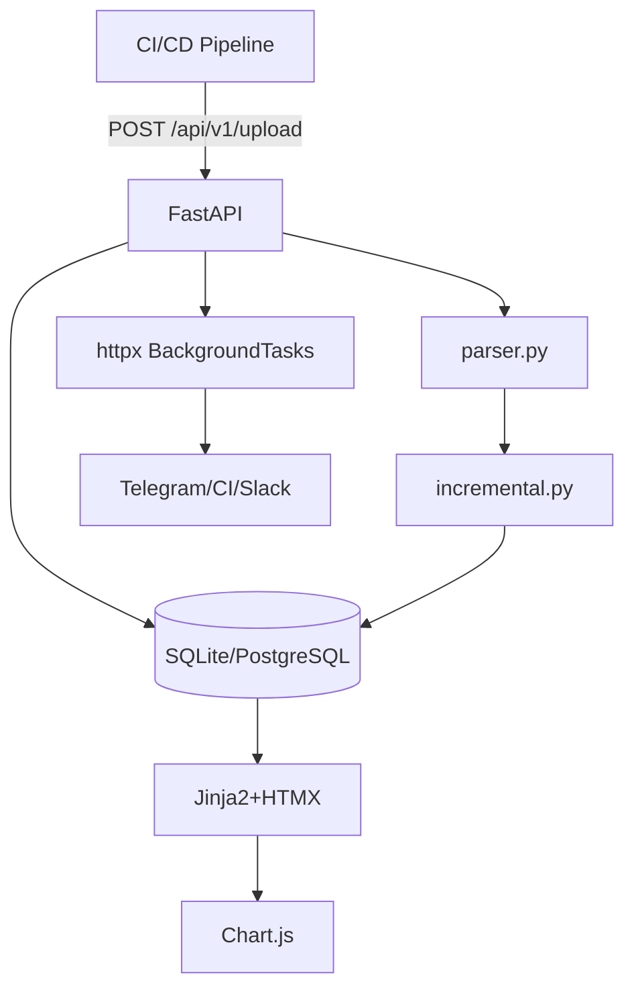

# 🏗 PVS-Tracker: Контекст проекта

## 🎯 Зачем существует
SonarQube не поддерживает инкрементальные отчёты PVS-Studio. Мы делаем легковесный сервис, который:
- Принимает JSON-отчёты из CI
- Считает `new / fixed / existing` между запусками
- Показывает тренды и таблицы с фильтрами через HTMX
- Авторизует через корпоративный LDAP
- Работает как нативная служба (без Docker)

## 🗺 Архитектура (Mermaid)


## ⚖️ Ключевые решения и почему
| Решение | Альтернатива | Причина |
|---------|--------------|---------|
| SQLite → Postgres | MySQL/Mongo | Простота старта, SQLModel-совместимость, ACID |
| BackgroundTasks вместо Redis | Celery/RQ | Нет распределённой очереди, отчёты < 1 мин |
| Фингерпринт: `file:line:code:msg` | Только `file:line` | PVS генерирует разные правила для одной строки |
| HTMX вместо React/SPA | Vue/Svelte | Быстрая разработка, сервер-рендеринг, минимум JS |
| Нативная служба | Docker | Корпоративный policy, нет Docker в продакшене |

## ⚠️ Известные нюансы PVS-Studio
1. JSON-формат меняется между мажорными версиями. Поля `warningCode`/`code`, `fileName`/`file`, `level`/`severity` могут отличаться.
2. Пути в отчёте зависят от ОС сборки. Windows: `C:\Build\src\main.cpp`, Linux: `/build/src/main.cpp`. Нормализуем в `/build/src/main.cpp`.
3. `pvs-studio-analyzer` может дублировать предупреждения при параллельном анализе. Дедупликация по фингерпринту обязательна.

## 📐 Границы ответственности
- ✅ Входит: приём отчётов, инкремент, UI, LDAP, вебхуки, служба
- ❌ Не входит: статический анализ кода, CI-пайплайны, Docker, Kubernetes, SSO, SAML, многопрофильность (только LDAP)
```
🔹 **Зачем:** AI перестаёт "галлюцинировать" альтернативы, понимает trade-offs и пишет код в рамках принятых ограничений.
