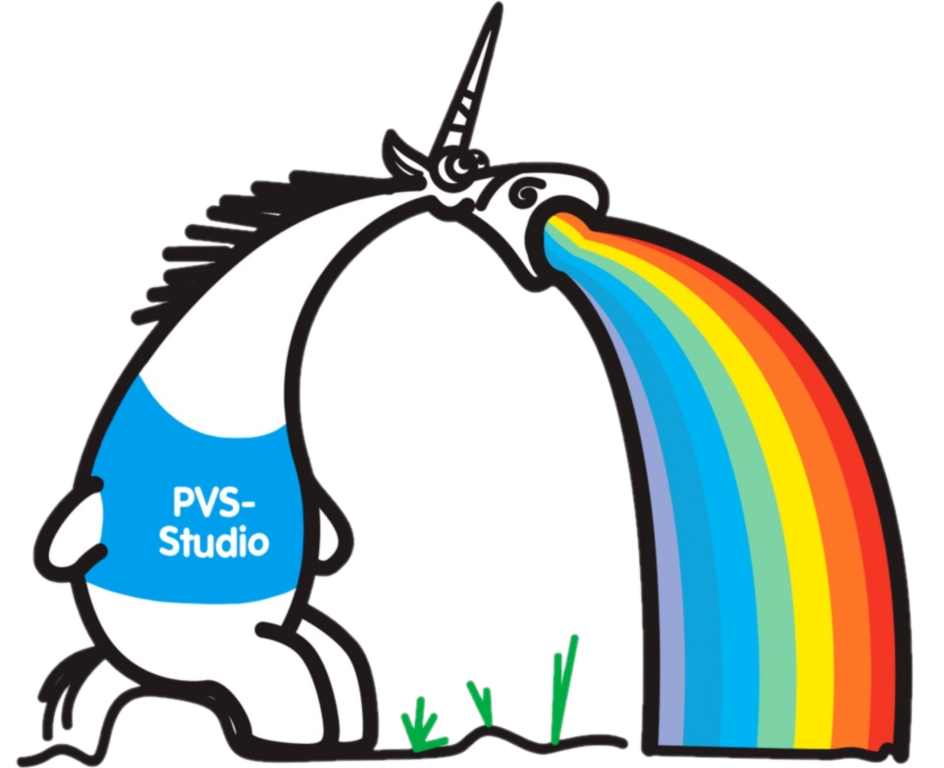
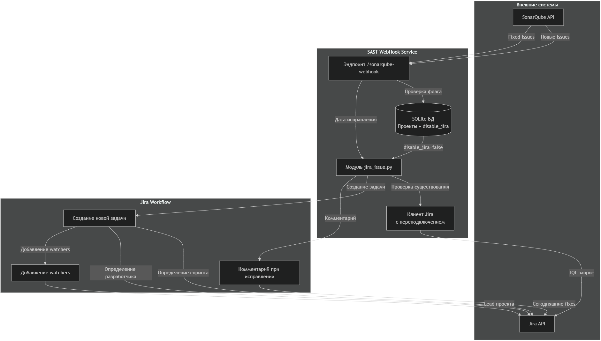

# 🛡️ SAST PVS+Sonar Project Manager

> **Устаревший standalone-сервис.** Функции CI/Jira/Jenkins и UI перенесены в монолит **[PVS-Studio Tracker](../README.md)** (`pvs_tracker/`). Для новых установок используйте трекер и [docs/jenkins-ci.md](../docs/jenkins-ci.md). Каталог сохранён для справки и миграции (`scripts/migrate_sonar_projects.py`).



Веб-сервис на **FastAPI** для управления проектами статического анализа кода **PVS-Studio**+**SonarQube**.

---

## ✨ Ключевые возможности

*   **📋 Управление проектами**: Создание, редактирование, клонирование, отключение и удаление проектов анализа кода через веб-интерфейс
*   **🔄 Приём веб-хуков**: Интеграция с **TFS** (TFVC и Git) и **SonarQube** для реагирования на события (пуши, коммиты, завершение анализа)
*   **🤖 Автоматизация через Jenkins**: Автоматический запуск задачи в Jenkins при получении веб-хука из системы контроля версий TFS для проведения нового анализа инструментами **PVS-Studio** и **SonarQube**
*   **🔗 Интеграция с SonarQube**: Автоматическое создание проектов в SonarQube, получение метрик качества кода (Quality Gate) и проблем (Issues) через REST API
*   **📁 Контекст кода и интеграция с Jira**: При обнаружении проблемы автоматически создаётся **Bug** в **Jira** с фрагментом исходного кода, в котором обнаружена проблема
*   **🔐 Безопасность**: Базовая HTTP-аутентификация для защиты эндпоинтов веб-хуков, внешние API (SonarQube, Jenkins, Jira) используют токены, администраторы определяются по IP-адресу и имени хоста. Только они могут удалять проекты
*   **📊 Логирование**: Централизованное логирование с ежедневной ротацией и автоматической очисткой старых файлов
*   **⚡ Rate Limiting**: Защита от перегрузки API с настраиваемыми лимитами для разных эндпоинтов
*   **💾 Кэширование**: Кэширование запросов к SonarQube API для уменьшения нагрузки и ускорения ответов

---

## 🏗️ Используемый стек технологий

*   **Бэкенд**: `Python 3.11+`, `FastAPI`, `SQLAlchemy`, `Pydantic`
*   **Фронтенд**: `Jinja2 Templates`, `HTML`, `CSS`
*   **База данных**: `SQLite3` (в будущем можно заменить на `PostgreSQL`)
*   **Внешние интеграции**:
    *   **Системы контроля версий**: `gitpython`, запросы к TFS REST API
    *   **Jenkins**: `jenkinsapi`
    *   **SonarQube**: REST API (`/api/issues/search`, `/api/sources/show`, `/api/projects/create`)
    *   **Jira**: REST API для создания и отслеживания задач
*   **Запуск**: ASGI-сервер `Uvicorn` для асинхронной обработки
*   **Кэширование**: `redis` (production) или in-memory (development)
*   **Rate Limiting**: `slowapi` (на базе Redis/memory)
*   **Тестирование**: `pytest`, `httpx`, `respx`

### 📐 Архитектура и поток данных



---

## 📦 Установка и запуск

### 1. Клонирование и настройка окружения

Т.к. репозиторий содержит несколько проектов, стандартным способом `git clone ...` получим лишнее.
Поэтому используем `Sparse Checkout` для загрузки только нужной папки проекта (выполняем команды в `Git Bash`.):
```bash
git clone --filter=blob:none --no-checkout http://qtfs:8080/tfs/QUIK/Quik_Automatization/_git/SAST
cd SAST

# Включаем Sparse Checkout
git sparse-checkout init --cone

# Указываем директорию проекта
git sparse-checkout set PVS_Sonar_WebHook_FastAPI

# Загружаем файлы из указанной директории
git checkout master
```

**Если git возвращает ошибку sparse-checkout (версия git ниже 2.20):**
```bash
# Клонируем репозиторий без файлов (только метаданные)
git clone --no-checkout http://qtfs:8080/tfs/QUIK/Quik_Automatization/_git/SAST
cd SAST

# Включаем sparsecheckout
git config core.sparsecheckout true

# Указываем нужные пути в .git/info/sparse-checkout
echo "PVS_Sonar_WebHook_FastAPI/*" >> .git/info/sparse-checkout

# Делаем checkout
git checkout master
```

**Установка зависимостей:**
```bash
cd PVS_Sonar_WebHook_FastAPI
python -m venv .venv # либо python3
# Windows:
.venv\Scripts\activate
# Linux/macOS:
source .venv/bin/activate
pip install -r requirements.txt
```

#### Установка pywin32 (Windows)

После установки зависимостей на Windows необходимо дополнительно настроить пакет `pywin32`:

```bash
# Windows:
.venv\Scripts\activate
python Scripts/pywin32_postinstall.py -install
```

**Что это делает:**
- Регистрирует DLL-библиотеки pywin32 в системе
- Устанавливает необходимые COM-компоненты
- Создаёт записи в реестре для работы с Windows API

**Важно:** После выполнения команды рекомендуется перезапустить терминал или IDE.

**Если команда не найдена:**
```bash
# Попробуйте запустить напрямую из папки venv:
.venv\python.exe -m pip install pywin32
.venv\python.exe Scripts\pywin32_postinstall.py -install
```

**Для чего используется pywin32:**
- Работа с Windows Registry
- Взаимодействие с COM-объектами
- Доступ к Windows API функциям
- Работа с сервисами Windows

#### Если у машины нет доступа к интернету, то нужно сперва загрузить пакеты:

Скачать все пакеты и их зависимости в виде `.whl` (они же колёса) или `.tar.gz` файлов в отдельную папку на машине с доступом к интернету. Добавляем флаги `--platform`, `--python-version`, `--no-deps` если архитектура сервера отличается, но для одинаковых систем это не обязательно.
**На машине с интернетом:**
```bash
pip download -r requirements.txt -d ./offline_packages
```
И скопировать получившуюся папку `offline_packages` на сервер в корень проекта.

**На целевом сервере (в виртуальной среде):**
```bash
pip install --no-index --find-links=./offline_packages -r requirements.txt
```

* `--no-index` — запрещает pip обращаться к интернет-индексу пакетов (PyPI)
* `--find-links=./offline_packages` — указывает pip искать пакеты в указанной локальной папке

### 2. Настройка переменных окружения

Создайте файл `.env` в корне проекта, подставив нужные значения переменным:

```env
# Веб-сервер
WEBHOOK_USERNAME=builder
WEBHOOK_PASSWORD=password

# SonarQube
SONARQUBE_URL=http://qube
SONARQUBE_TOKEN=sqp_sonarqube_token_here
SONARQUBE_WEBHOOK_SECRET=default_secret_here
SONARQUBE_VERIFY_SIGNATURE=false
SONARQUBE_STRICT_SIGNATURE=false
SONARQUBE_REQUIRE_AUTH=false
SONARQUBE_USERNAME=builder
SONARQUBE_PASSWORD=password
NEW_CODE_ONLY=true

# Jenkins
JENKINS_URL=https://newbuilder
JENKINS_USERNAME=builder
JENKINS_TOKEN=jenkins_api_token
JENKINS_JOB_NAME=Test_FastAPI

# Jira
JIRA_USERNAME=jira_import
JIRA_PASSWORD=password
JIRA_URL=https://salta:8443

# Адреса администраторов
ADMIN_IPS=192.168.32.139,192.168.32.133,192.168.32.79
ADMIN_HOSTNAMES=pc-ieme,pc-vvor,pc-aalex
```

### 3. Запуск
Вместо `8080` указать нужный порт:
```bash
uvicorn app.main:app --host 0.0.0.0 --port 8080 --reload --reload-dir app
```

После запуска сервис буде доступен в браузере: [http://qube:8080](http://qube:8080)

### 4. Инициализация базы данных

При первом запуске база данных инициализируется автоматически.

(Опционально) Для применения миграции существующих проектов (из файлов `D:\source\Projects`):

```bash
curl http://qube:8080/migrate-projects
```

---

## 🚀 Основные сценарии использования

### 1. Добавление нового проекта анализа
1.  Перейдите на главную страницу (`/`)
2.  Заполните форму по инструкции на [QWiki](http://qteam:8888/Автоматизация-статического-анализа-кода-PVS-SonarQube-temp.ashx)
3.  Нажмите "Создать проект". Проект появится в общем списке и будет создан в SonarQube

### 2. Просмотр и управление проектами (`/list`)
*   Проекты сгруппированы по названию группы
*   **Внутри каждой группы проекты отсортированы по алфавиту** (по `sonar_project_name`)
*   Для каждого проекта доступны действия (также описанные более подробно на [QWiki](http://qteam:8888/Автоматизация-статического-анализа-кода-PVS-SonarQube-temp.ashx)):
    *   **Клонировать/Редактировать проект**
    *   **Включить/Выключить проект**
    *   **Проанализировать сейчас**
    *   **Начать/Приостановить создание задач**
    *   **Удалить** (только для администраторов, которые заданы в `.env`): Удаляет проект из БД и SonarQube

### 3. Работа с веб-хуками
*   **Эндпоинт TFS/Git**: `http://qube:8080/webhook`
    *   Настройте в TFS веб-хук на события:
        *   Для Git-репозиториев `Code pushed`
        *   Для TFVC-репозиториев `Code checked in`
    *   Добавьте заголовки:
        *   `X-TFS-Repo-Type` — тип репозитория
        *   `X-TFS-Repo-Name` — название репозитория
        *   `X-TFS-Proj-Name` — название проекта (`sonar_project_name`)
        *   `X-TFS-Group-Name` — группа проектов
*   **Эндпоинт SonarQube**: `http://qube:8080/sonarqube-webhook`
    *   Настройте в SonarQube: `Administration → Webhooks`
    *   При получении хука сервис запрашивает детали анализа и проблемы (Issues) через REST API

---

## 🔧 Основные API эндпоинты сервиса

| Метод | Эндпоинт | Описание |
| :--- | :--- | :--- |
| `GET` | `/` | Главная страница с формой |
| `GET` | `/list` | Страница со списком всех проектов и возможностью управления ими |
| `POST` | `/project` | Создание или обновление проекта |
| `POST` | `/webhook` | Основной эндпоинт для веб-хуков от TFS |
| `POST` | `/sonarqube-webhook` | Эндпоинт для веб-хуков от SonarQube |
| `GET` | `/migrate-projects` | Инструмент миграции существующих проектов из файловой структуры в БД |

[Подробнее в документации API](http://qube:8080/docs)

---

## 📁 Структура проекта

```
PVS_Sonar_WebHook_FastAPI/
├── .well-known/: специальная директория для веб-стандартов
│   └── appspecific/: файлы для Chrome DevTools расширения
│       ├── background.js: фоновая страница расширения
│       ├── com.chrome.devtools.json: манифест расширения Chrome DevTools
│       ├── content.js: контент-скрипт расширения
│       ├── devtools.html: HTML интерфейс панели DevTools
│       └── devtools.js: JavaScript логика панели DevTools
├── app/: основной код сервиса Python
│   ├── __init__.py
│   ├── atlas-arqa-ru-chain.pem: сертификат для работы с Jira API
│   ├── config.py: загрузка настроек (Pydantic Settings)
│   ├── crud.py: операции с БД (CRUD для проектов)
│   ├── database.py: настройка подключения к БД (SQLAlchemy)
│   ├── cache.py: кэширование запросов к SonarQube (Redis/in-memory)
│   ├── rate_limiter.py: конфигурация rate limiting (SlowAPI)
│   ├── logging_config.py: централизованное логирование
│   ├── import_csv_to_db.py: вспомогательный скрипт для импорта из CSV в БД SQLite3
│   ├── jenkins_example.py: примеры функций для работы с Jenkins
│   ├── jira_issue.py: функции для работы с Jira API
│   ├── main.py: точка входа FastAPI сервиса, роутинг, конфигурация
│   ├── migrate.py: скрипты миграции проектов
│   ├── models.py: SQLAlchemy модели (Project)
│   ├── sonarqube_api_client.py: клиент для работы с SonarQube REST API (с кэшированием)
│   ├── sonarqube_webhook.py: логика обработки веб-хуков SonarQube
│   ├── webhooks.py: логика обработки веб-хуков TFS/Git
│   ├── services/: бизнес-логика сервисов
│   └── templates/: HTML шаблоны (Jinja2)
│       ├── base.html: базовый шаблон с общей разметкой, стилями, скриптами
│       ├── index.html: форма создания/редактирования проекта
│       └── list.html: страница со списком проектов
├── docs/: документация
│   ├── logging.md: руководство по логированию
│   ├── caching.md: руководство по кэшированию
│   └── rate_limiting.md: руководство по rate limiting
├── tests/: тесты
│   ├── conftest.py: фикстуры pytest
│   ├── test_webhooks.py: тесты webhook handlers
│   ├── test_cache.py: тесты кэширования
│   ├── test_logging.py: тесты логирования
│   └── README.md: документация по тестированию
├── get_version/: файлы для Jenkins (получение версии проекта из исходников)
│   ├── get-version-linux.py: скрипт для Linux
│   ├── get_version.py: скрипт для Windows
│   ├── get_version_orig.py: старая версия скрипта
│   └── parse_plog.py: объединение логов Windows- и Linux-анализов PVS-Studio
├── Scripts_cmd/: старые cmd-скрипты
│   ├── credentials.cmd: получение кредов для Jenkins
│   ├── execution_task.cmd: основной скрипт для запуска Jenkins-задачи
│   ├── find_cpp_files_git.cmd: определяет, были ли изменения в C++ файлах для Git-репозиториев
│   ├── find_cpp_files_tfvc.cmd: определяет, были ли изменения в C++ файлах для TFVC-репозиториев
│   ├── ini_parser.cmd: парсит ini-файл
│   └── set_env_vars_from_ini.cmd: получает переменные из ini-файла
├── static/: статические файлы (CSS, JS, изображения)
│   └── ico.png: иконка сайта
├── logs/: директория для логов (создаётся автоматически)
│   ├── app.log: главный лог приложения
│   ├── webhooks/: логи TFS/Git веб-хуков
│   └── sonarqube/: логи SonarQube веб-хуков
├── webhook_scripts/: PowerShell-скрипты для работы с TFS
│   ├── builder_credentials.xml
│   ├── delete_hook.ps1: удаление веб-хука
│   ├── get-cred.ps1: сохранение данных пользователя в зашифрованном виде
│   ├── get_id.ps1: обработка полученных данных из письма о добавлении нового проекта для запуска скрипта создания веб-хука
│   ├── post_webhook_git.ps1: создание веб-хука для Git-репозиториев
│   ├── post_webhook_tfvc.ps1: создание веб-хука для TFVC-репозиториев
│   ├── repositories.json: пример ответа от TFS
│   ├── test_webhook.ps1
│   └── webhook_credentials.xml
├── web_form/: старая веб-форма на PHP
│   ├── index.php
│   ├── list.php
│   ├── list_orig.php
│   └── list_test.php
├── .env: файл с переменными окружения (не в репозитории)
├── .gitignore: список игнорируемых Git файлов и директорий
├── main.py: альтернативная точка входа для запуска сервиса
├── pvs_sonar.db: база данных SQLite3 (создаётся автоматически)
├── README.md: документация (этот файл)
├── requirements.txt: зависимости Python
├── run.py: скрипт запуска сервиса
├── init_db.py: скрипт инициализации БД
├── run_scanner.py: скрипт запуска сканера
├── test_webhooks.py: CLI-скрипт для тестирования вебхуков
├── pytest.ini: конфигурация pytest
```

---

## 🧪 Тестирование

### Запуск тестов

```bash
# Установить зависимости для тестирования
pip install -r requirements.txt

# Запустить все тесты
pytest

# Запустить с verbose выводом
pytest -v

# Запустить с отчётом о покрытии
pytest --cov=app --cov-report=html

# Открыть отчёт о покрытии
# Windows: start htmlcov/index.html
# Linux/macOS: open htmlcov/index.html
```

### Запуск тестов по категориям

```bash
# Тесты вебхуков
pytest tests/test_webhooks.py -v

# Тесты кэширования
pytest tests/test_cache.py -v

# Тесты логирования
pytest tests/test_logging.py -v

# Тесты rate limiting
pytest tests/test_webhooks.py::TestRateLimiting -v
```

### Тестирование вебхуков через CLI

```bash
# Протестировать все эндпоинты
python test_webhooks.py --base-url http://localhost:8080

# Протестировать только TFS webhook
python test_webhooks.py --type tfs

# Протестировать только SonarQube webhook
python test_webhooks.py --type sonarqube

# Протестировать health checks
python test_webhooks.py --type health

# С другими параметрами
python test_webhooks.py --help
```

---

## 🔧 Настройка Redis для production

Для использования Redis в production:

1. **Установите Redis:**
   ```bash
   # Docker
   docker run -d -p 6379:6379 redis:alpine
   
   # Или установите системный пакет
   ```

2. **Настройте подключение в коде:**
   ```python
   # В app/main.py или startup коде
   from app.cache import init_cache
   init_cache(redis_url="redis://localhost:6379")
   ```

3. **Проверьте подключение:**
   ```bash
   redis-cli ping
   # Ответ: PONG
   ```

---

## 📊 Мониторинг

### Метрики для отслеживания

- **Hit rate кэша** — отношение попаданий к запросам (целевое: >70%)
- **Rate limit срабатывания** — количество 429 ответов
- **Время ответа API** — среднее время обработки запросов
- **Объём логов** — MB логов в день

### Логи

- **app.log** — основные события приложения
- **webhooks/tfs_webhook.log** — обработка TFS/Git вебхуков
- **sonarqube/sonarqube_webhook.log** — обработка SonarQube вебхуков

## 🏗️ Описание работы сервиса

**1. Модель данных и хранилище** (`app/models.py`, `app/database.py`):
В БД SQLite3 хранятся данные проекта:
*   `group = Column(String)`: группа проекта
*   `author_email = Column(String)`: почта для обратной связи и уведомления об окончании времени жизни проекта
*   `sonar_project_name = Column(String)`: название проекта в SonarQube
*   `sonar_project_key = Column(String)`: уникальный ключ для проекта
*   `jira_project = Column(String)`: имя проекта в Jira
*   `cvs_system = Column(String)`: тип репозитория
*   `tfs_path = Column(String)`: ссылка на репозиторий
*   `sub_modules = Column(Boolean, default=False)`: включить sub-модули
*   `another_branch = Column(String, default="")`: ветка/branch (master/main)
*   `life_time = Column(String)`: время жизни проекта
*   `cmake_msbuild = Column(String)`: сборка CMake или MSBuild
*   `select_vcxproj = Column(String, default="")`: 
*   `pvs_exclude_vcxproj = Column(String, default="")`: PVS exclude 'vcxproj' (список проектов для исключения из анализа)
*   `pvs_exclude_path = Column(String, default="")`: PVS exclude path (список директорий для исключения из анализа)
*   `pvs_check_conf_name = Column(String)`: конфигурация
*   `pvs_check_arch = Column(String)`: архитектура
*   `cmake_win_commands = Column(String)`: команды для конфигурации Windows-версии
*   `cmake_linux_command = Column(String, default="")`: команды для конфигурации Linux-версии
*   `disabled = Column(Boolean, default=False)`: включить/выключить проверку проекта
*   `last_processed_changeset = Column(String)`: хэш последнего commit/changeset
*   `version = Column(String)`: версия проекта, которая указана в исходниках
*   `disable_jira = Column(Boolean, default=True)`: включить/выключить создание задач в Jira

**2. Обработка веб-хуков** (`app/webhooks.py`, `app/sonarqube_webhooks.py`):
*   `app/webhooks.py`обрабатывает полученный из TFS век-хук, который содержит:
    *   Для Git:
        *   Repository
        *   Branch
        *   Commit
        *   Project name
        *   Group project
    *   Для TFVC:
        *   Changeset
        *   Repository
        *   Project name
        *   Group project
*   Если проект существует в БД, то отправляет REST API запрос в Jenkins на запуск анализа `PVS-Studio+SonarQube`
*   Если проект не существует в БД и ветка содержит `release`, то создаёт новый проект для этой релизной ветки и также отправляет запрос в Jenkins
*   После успешного анализа `SonarQube` отправляет веб-хук, который обрабатывается `app/sonarqube_webhooks.py`. Содержание хука:
    *   `webhook_id`: X-Sonar-Webhook-Id
    *   `webhook_timestamp`: X-Sonar-Webhook-Timestamp
    *   `user_agent`: User-Agent
    *   `client_ip`: Client Host
    *   `content_type`: Content-Type
    *   `content_length`: Content-Length
    *   `signature_header`: X-Sonar-Webhook-HMAC-SHA256
*   Если получен веб-хук от данного проекта, то он автоматически обновит исходники (`git pull`)

**3. Клиент SonarQube API** (`app/sonarqube_api_client.py`):
*   Получает Issues проекта, эндпоинт `http://qube/api/issues/search`:
    *   `componentKeys`: SonarQube Project Key
    *   `types`: типы Issues
    *   `resolved`: открытые Issues
    *   `createdAfter`: за сегодня (т.е. новые)
    *   `ps`: количество результатов
*   Получает фрагмент кода, эндпоинт `http://qube/api/sources/show`:
    *   `projects`: SonarQube Project Key
*   Получает статус `quality gate`, эндпоинт `http://qube/api/qualitygates/project_status`:
    *   `key`: Issues ID
    *   `from`: первая строка
    *   `to`: последняя строка

**4. Интеграция с Jira** (`app/jira_issue.py`):
*   **Создание задач**: При обнаружении новой проблемы в SonarQube, если `disable_jira=False`
*   **Логика создания**:
    1.  Поиск проекта в Jira по `jira_project`
    2.  Определение активного спринта по `version`
    3.  Определение разработчика: из автора последнего коммита (Git) или changeset (TFVC)
    4.  Проверка на дубликат по полю `SonarQube Issue ID`
    5.  Создание Bug с привязкой к спринту, назначением и фрагментом кода
    6.  Автоматическое добавление lead проекта как watcher
*   **Отслеживание исправлений**: Добавление комментария, если проблема исправлена

**5. Обработка ошибок**:
*   При ошибке в работе сервиса отправляется письмо с описанием ошибки
*   Также ошибки логируются в `logs/`

---

## 🆕 Новые возможности (v2.0)

### 📊 Централизованное логирование

Единая система логирования с ежедневной ротацией и автоматической очисткой:

```python
from app.logging_config import get_logger

logger = get_logger(__name__)
logger.info("Сообщение", extra={"repo_type": "Git", "repo_name": "MyRepo"})
```

**Преимущества:**
- Ежедневная ротация с очисткой файлов старше 30 дней
- Структурированное логирование с контекстом
- Раздельные логи для компонентов (`logs/webhooks/`, `logs/sonarqube/`)
- Context manager для временного контекста

📖 **Подробная документация:** [`docs/logging.md`](docs/logging.md)

### ⚡ Rate Limiting

Защита API от перегрузки с настраиваемыми лимитами:

| Endpoint | Лимит |
|----------|-------|
| `/webhook` | 30 запросов/минуту |
| `/sonarqube-webhook` | 10 запросов/минуту |
| `/project/delete/*` | 5 запросов/минуту |
| `/project/analyze/*` | 10 запросов/минуту |
| Health checks | 120 запросов/минуту |

**Заголовки ответов:**
```
X-RateLimit-Limit: 30
X-RateLimit-Remaining: 25
Retry-After: 60  (при 429 ответе)
```

📖 **Подробная документация:** [`docs/rate_limiting.md`](docs/rate_limiting.md)

### 💾 Кэширование SonarQube API

Кэширование запросов к SonarQube для уменьшения нагрузки:

```python
from app.cache import get_cache, CacheTTL

cache = get_cache()

# Получение из кэша
cached = cache.get("issues/search", {"componentKeys": project_key})
if cached:
    return cached

# Сохранение в кэш
data = fetch_from_api()
cache.set("issues/search", data, {"componentKeys": project_key}, CacheTTL.ISSUES)
```

**TTL для разных типов данных:**
- Issues: 5 минут
- Quality Gate: 5 минут
- Measures: 10 минут
- Code snippets: 1 час
- Project info: 2 часа

**Бэкенды:**
- Redis (production)
- In-memory (development/testing)

📖 **Подробная документация:** [`docs/caching.md`](docs/caching.md)

### 🧪 Тестирование

#### Webhook Test Script

CLI-утилита для тестирования вебхуков:

```bash
# Протестировать все вебхуки
python test_webhooks.py --base-url http://localhost:8080

# Только TFS/Git webhook
python test_webhooks.py --type tfs

# Только health checks
python test_webhooks.py --type health
```

📖 **Документация:** [`test_webhooks.py --help`](test_webhooks.py)

#### Unit-тесты

```bash
# Запустить все тесты
pytest

# С отчётом о покрытии
pytest --cov=app --cov-report=html

# Конкретный файл тестов
pytest tests/test_webhooks.py -v
```

📖 **Подробная документация:** [`tests/README.md`](tests/README.md)

---

## 📚 Дополнительная документация

| Файл | Описание |
|------|----------|
| [`QWEN.md`](QWEN.md) | Полная документация для разработчиков |
| [`spec.md`](spec.md) | Техническая спецификация |
| [`docs/logging.md`](docs/logging.md) | Руководство по логированию |
| [`docs/caching.md`](docs/caching.md) | Руководство по кэшированию |
| [`docs/rate_limiting.md`](docs/rate_limiting.md) | Руководство по rate limiting |
| [`tests/README.md`](tests/README.md) | Документация по тестированию |

---

## 📝 Changelog

### v2.0 (2025)
- ✅ Рефакторинг логирования (централизованная система)
- ✅ Rate limiting для всех endpoints
- ✅ Кэширование запросов к SonarQube API
- ✅ Unit-тесты для webhook handlers
- ✅ CLI-скрипт для тестирования вебхуков

### v1.x
- Базовая функциональность управления проектами
- Интеграция с TFS/Git/SonarQube/Jira
- Веб-интерфейс для CRUD операций