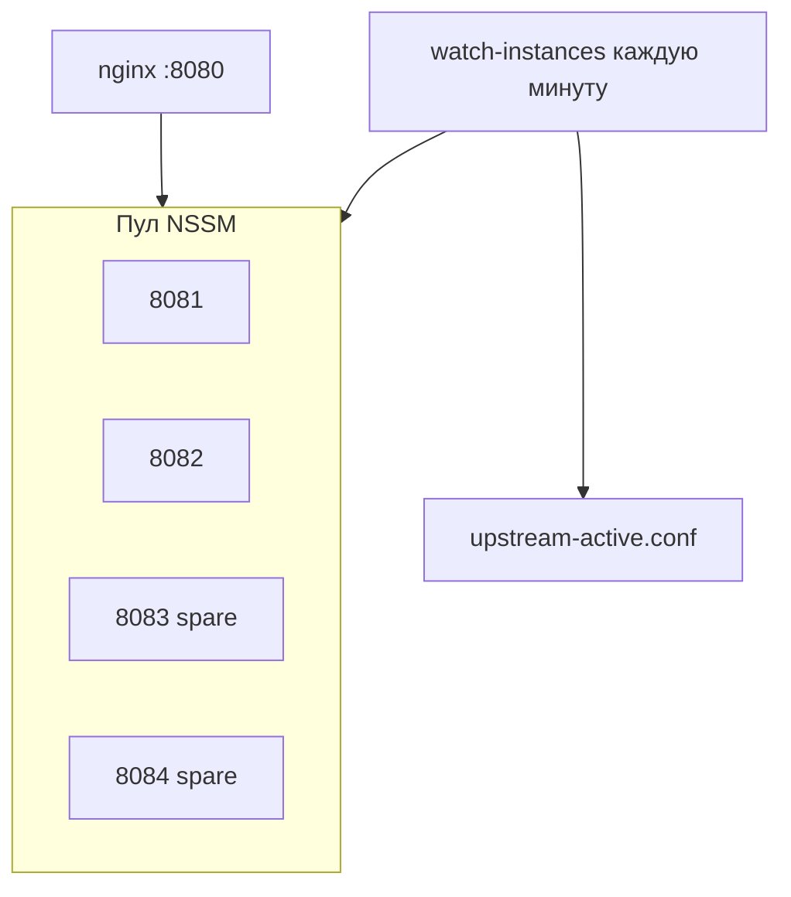

# Nginx + NSSM — zero-downtime и минимум 2 healthy app

Стек для **Windows Server** без Docker: nginx на `:8080`, пул uvicorn за NSSM.

## Идея



| Правило | Значение по умолчанию |
|---------|----------------------|
| Минимум healthy backend | **2** (`MinHealthyInstances`) |
| Штатно запущено | **2** (`DesiredRunningInstances`) |
| Пул портов | 8081–8084 (`PortPool`) |

Если один app упал или в drain при обновлении — watchdog **запускает spare** из пула (8083, 8084), пересобирает `upstream-active.conf`, `nginx -s reload`.

## Установка

0. **NSSM** (если `nssm` не в PATH):

```powershell
cd deploy\nginx
.\install-nssm.ps1
# при proxy: .\install-nssm.ps1 -HttpProxy http://proxy.corp.local:8080
```

Проверка: `C:\nssm\nssm.exe version` или `nssm version` после добавления в PATH.

1. PostgreSQL, `.env` с `DATABASE_URL` в `AppRoot`.
2. Скопируйте [`nginx.conf`](nginx.conf) и [`upstream-active.conf`](upstream-active.conf) в `C:\nginx\conf\`.
3. Отредактируйте [`instances.config.ps1`](instances.config.ps1) (`NginxConfDir`, пул портов).
4. PowerShell **от администратора**:

```powershell
cd deploy\nginx
.\install-services.ps1 -AppRoot "C:\opt\pvs-tracker" -Python "C:\opt\pvs-tracker\.venv\Scripts\python.exe" -NssmPath "C:\nssm\nssm.exe"
.\sync-upstream.ps1 -ReloadNginx
.\register-watchdog.ps1
```

`-NssmPath` можно опустить, если `nssm` в PATH или файл лежит в `C:\nssm\nssm.exe`.

Если при первом старте `SERVICE_PAUSED` - обновите скрипты (`git pull`) или вручную:

```powershell
Resume-Service PVS-Tracker-8081
Get-Service PVS-Tracker-*
```

5. Запустите nginx. Webhook: `http://<host>:8080/webhook/inbound`.

## Watchdog

```powershell
.\watch-instances.ps1 -StopExcessSpares   # вручную
```

Задача планировщика `PVS-Tracker-Nginx-Watchdog` (каждую минуту):

- считает `GET /health/ready` на каждом порту пула;
- если healthy меньше 2 — стартует следующую остановленную службу;
- пишет `upstream-active.conf` только из **ready** backend'ов;
- drained-порты помечает `down` (rolling update);
- опционально гасит лишние spare сверх `DesiredRunningInstances`.

## Rolling update

После `git pull` / `pip install` в `AppRoot`:

```powershell
.\rolling-update.ps1 -Port 8081
.\rolling-update.ps1 -Port 8082
```

Скрипт:

1. Поднимает **min+1** healthy (запасной spare);
2. Drain порта в `drained-ports.txt` + reload nginx;
3. `Restart-Service PVS-Tracker-<port>`;
4. Ждёт `/health/ready`;
5. Снимает drain, sync upstream.

С остановкой лишнего spare после обновления:

```powershell
.\rolling-update.ps1 -Port 8081 -StopSpareAfterUpdate
```

## Файлы

| Файл | Назначение |
|------|------------|
| `instances.config.ps1` | Min healthy, пул портов, пути nginx |
| `pvs-nginx-lib.ps1` | Общие функции |
| `ensure-min-instances.ps1` | Запуск spare до N healthy |
| `sync-upstream.ps1` | Генерация `upstream-active.conf` |
| `watch-instances.ps1` | Watchdog |
| `register-watchdog.ps1` | Задача в Планировщике |
| `drained-ports.txt` | В `NginxConfDir`, порты в drain |

## Диагностика

```powershell
Get-Service PVS-Tracker-*
Invoke-WebRequest http://127.0.0.1:8081/health/ready -UseBasicParsing
Get-Content C:\nginx\conf\upstream-active.conf
Get-Content C:\nginx\conf\drained-ports.txt -ErrorAction SilentlyContinue
```
