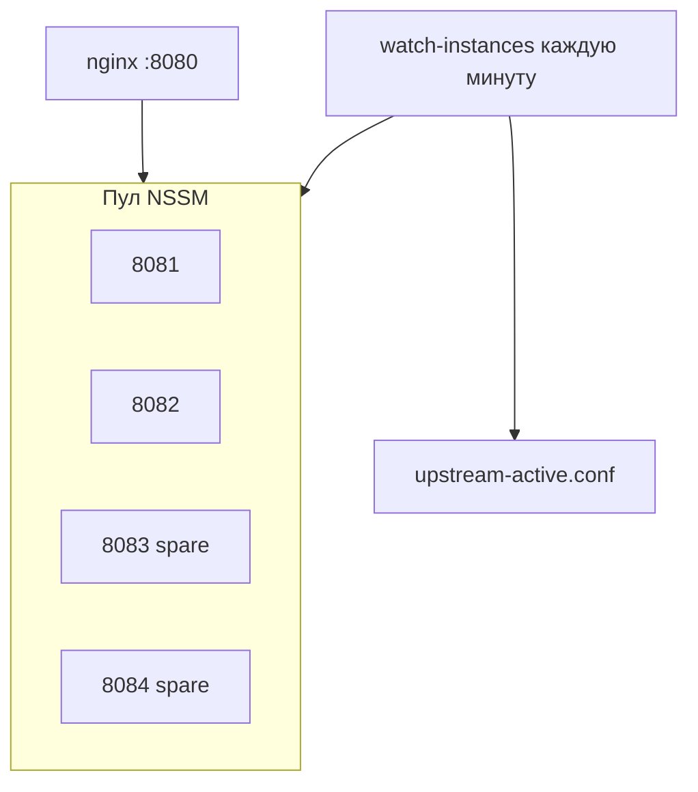

# Nginx + NSSM — zero-downtime и минимум 2 healthy app

Стек для **Windows Server** без Docker: nginx на `:8080`, пул uvicorn за NSSM.

## Идея



| Правило | Значение по умолчанию |
|---------|----------------------|
| Минимум healthy backend | **2** (`MinHealthyInstances`) |
| Штатно запущено | **2** (`DesiredRunningInstances`) |
| Пул портов | 8081–8084 (`PortPool`) |

Если один app упал или в drain при обновлении — watchdog **запускает spare** из пула (8083, 8084), пересобирает `upstream-active.conf`, `nginx -s reload`.

## Установка

0. **NSSM** (если `nssm` не в PATH):

```powershell
cd deploy\nginx
.\install-nssm.ps1
# при proxy: .\install-nssm.ps1 -HttpProxy http://proxy.corp.local:8080
```

Проверка: `C:\nssm\nssm.exe version` или `nssm version` после добавления в PATH.

1. PostgreSQL, `.env` с `DATABASE_URL` в `AppRoot`.
2. **nginx for Windows** в `C:\nginx` (скрипт или вручную):

```powershell
cd deploy\nginx
.\install-nginx.ps1
# уже есть C:\nginx\nginx.exe:
.\start-nginx.ps1 -CopyConf
```

3. Отредактируйте [`instances.config.ps1`](instances.config.ps1) (`NginxConfDir`, пул портов).
4. PowerShell **от администратора** — пул uvicorn (8081–8084):

```powershell
cd deploy\nginx
.\install-services.ps1 -AppRoot "C:\opt\pvs-tracker" -Python "C:\opt\pvs-tracker\.venv\Scripts\python.exe" -NssmPath "C:\nssm\nssm.exe"
.\sync-upstream.ps1 -ReloadNginx
.\register-watchdog.ps1
```

`-NssmPath` можно опустить, если `nssm` в PATH или файл лежит в `C:\nssm\nssm.exe`.

Перед установкой служб скрипт проверяет venv и подключение к PostgreSQL. Все переменные из `.env` попадают в NSSM.

Если spare отвечает на `/health/live`, но не на `/health/ready` — неверный `DATABASE_URL` в NSSM:

```powershell
cd deploy\nginx
.\sync-nssm-env.ps1 -AppRoot "C:\opt\pvs-tracker" -RestartServices
C:\nssm\nssm.exe get PVS-Tracker-8083 AppEnvironmentExtra DATABASE_URL
```

**Важно:** `install-services.ps1` поднимает только **backend** (8081+). Браузер открывает **`:8080`** — это nginx. Без `.\start-nginx.ps1` страница не откроется.

### SCM `Paused`, но `/health/live` отвечает 200

На некоторых Windows Server NSSM оставляет службу в статусе **Paused**, пока uvicorn уже слушает порт.
Это нормально: скрипты считают экземпляр живым по HTTP и **не** вызывают `nssm continue`
(он часто отвечает `Unexpected status SERVICE_PAUSED`).

Проверка:

```powershell
Get-Service PVS-Tracker-*
Invoke-WebRequest http://127.0.0.1:8081/health/live -UseBasicParsing
```

Resume-Service опционален и не обязателен для работы nginx upstream.

При rolling update spare (8083+) стартует через `nssm start`; ответ `SERVICE_PAUSED` — норма.
Скрипт **ждёт HTTP**, не вызывает `nssm continue` в цикле. Если spare застрял Paused без HTTP —
делается `nssm stop` + повторный `start`.

5. UI и webhook: `http://localhost:8080/` и `http://<host>:8080/webhook/inbound`.

## Watchdog

```powershell
.\watch-instances.ps1 -StopExcessSpares   # вручную
```

Задача планировщика `PVS-Tracker-Nginx-Watchdog` (каждую минуту):

- считает `GET /health/ready` на каждом порту пула;
- если healthy меньше 2 — стартует следующую остановленную службу;
- пишет `upstream-active.conf` только из **ready** backend'ов;
- drained-порты помечает `down` (rolling update);
- опционально гасит лишние spare сверх `DesiredRunningInstances`.

## Rolling update

После `git pull` / `pip install` в `AppRoot`:

```powershell
.\rolling-update.ps1 -Port 8081
.\rolling-update.ps1 -Port 8082
```

Скрипт:

1. Поднимает **min+1** healthy (запасной spare);
2. Drain порта в `drained-ports.txt` + reload nginx;
3. `Restart-Service PVS-Tracker-<port>`;
4. Ждёт `/health/ready`;
5. Снимает drain, sync upstream.

С остановкой лишнего spare после обновления:

```powershell
.\rolling-update.ps1 -Port 8081 -StopSpareAfterUpdate
```

## Файлы

| Файл | Назначение |
|------|------------|
| `instances.config.ps1` | Min healthy, пул портов, пути nginx |
| `pvs-nginx-lib.ps1` | Общие функции |
| `ensure-min-instances.ps1` | Запуск spare до N healthy |
| `sync-upstream.ps1` | Генерация `upstream-active.conf` |
| `watch-instances.ps1` | Watchdog |
| `register-watchdog.ps1` | Задача в Планировщике |
| `sync-nssm-env.ps1` | Синхронизация `.env` -> NSSM для всех служб |
| `install-services.ps1` | Установка пула NSSM (8081+) |
| `install-nginx.ps1` | Скачать nginx for Windows в `C:\nginx` |
| `start-nginx.ps1` | Запуск / reload nginx на :8080 |
| `drained-ports.txt` | В `NginxConfDir`, порты в drain |

## Диагностика

```powershell
# Backend (uvicorn)
Get-Service PVS-Tracker-*
Invoke-WebRequest http://127.0.0.1:8081/health/ready -UseBasicParsing
Invoke-WebRequest http://127.0.0.1:8082/health/ready -UseBasicParsing

# Reverse proxy (nginx :8080) — отдельный процесс!
Get-Process nginx -ErrorAction SilentlyContinue
Test-NetConnection 127.0.0.1 -Port 8080
Invoke-WebRequest http://127.0.0.1:8080/health/ready -UseBasicParsing

Get-Content C:\nginx\conf\upstream-active.conf
Get-Content C:\nginx\conf\drained-ports.txt -ErrorAction SilentlyContinue
Get-Content C:\nginx\logs\pvs-tracker-error.log -Tail 30 -ErrorAction SilentlyContinue
```

Если 8081/8082 OK, а **8080 не открывается** — nginx не запущен:

```powershell
cd deploy\nginx
.\start-nginx.ps1 -CopyConf
```
